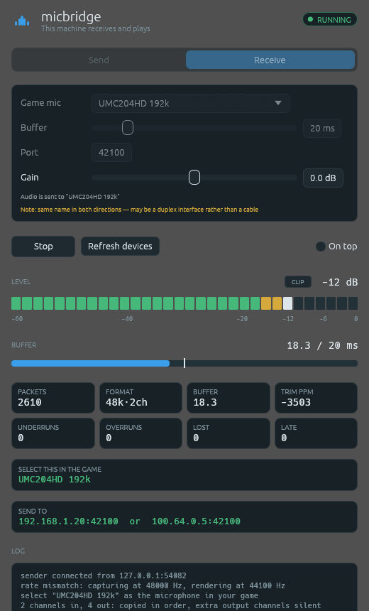
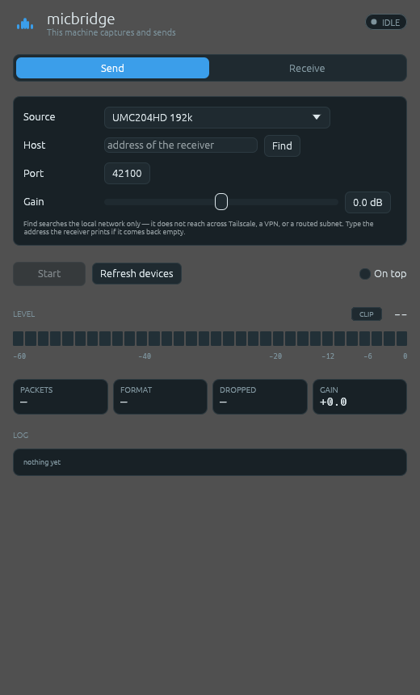

<div align="center">


# micbridge

**Use a microphone plugged into one computer on a different computer.**

[](https://github.com/dieterpl/micbridge/releases/latest)
[](#licence)
[](rust-toolchain.toml)
[](https://github.com/dieterpl/micbridge/releases/latest)

</div>

Your audio interface is plugged into the Mac. The game is on the Windows box. The
game needs to hear the interface. micbridge streams the audio across your network
and makes it arrive as an ordinary microphone on the other machine — no cables
moved, no drivers written.

Built to play proximity-chat games — Lethal Company, PEAK, Burgling Gnomes —
streamed over Moonlight, where the game hears nothing because the microphone is
plugged into the machine you are streaming *from*. General enough for any pair of
machines, and the interface stays fully usable on the Mac while it streams.

<div align="center">



<sub>The receiving end, with a tone flowing. Captured on macOS.</sub>

</div>

```
Mac                                     Windows
────────────────────────────────        ──────────────────────────────
UMC204HD ──CoreAudio──┐                 ┌──> jitter buffer
                      │                 │    drift-corrected resample
                 ring │                 │    WASAPI render
                      └───── UDP ───────┘         │
                    (seq + frame index)    "CABLE Input"
                                                  │
                                           "CABLE Output" ──> game mic
```

## How it works

The device is never moved. micbridge reads it as an ordinary audio input and ships
the PCM over the network — not USB/IP, and deliberately not. Audio over IP works
over Tailscale and any WAN, where USB passthrough does not, and it needed no driver
to be written on either side.

The trade is that the far machine sees a generic recording endpoint rather than a
Behringer, so the vendor's control panel and ASIO are not available there. For "a
game can hear this input" that costs nothing: games read microphones through the
system default and never ask what the hardware is.

`docs/design.md` has the full reasoning, `docs/protocol.md` the wire format.

## Install

Download from [Releases](https://github.com/dieterpl/micbridge/releases/latest).
Each archive holds a window (`micbridge-gui`) and a command line (`micbridge`).

| Platform | File |
|---|---|
| macOS, Apple Silicon or Intel | `micbridge-macos-universal-app.zip` — `MicBridge.app` |
| macOS, bare binaries | `micbridge-macos-universal.tar.gz` |
| Windows 10/11 | `micbridge-windows-x86_64.zip` |
| Linux x86-64, glibc 2.35+ | `micbridge-linux-x86_64.tar.gz` |

`SHA256SUMS` is published beside them: `sha256sum -c SHA256SUMS` on Linux,
`shasum -a 256 -c SHA256SUMS` on macOS. [CHANGELOG.md](CHANGELOG.md) says what is
in each release.

Prefer the `.app` on macOS — the reason is under
[Setup on the sending machine](#setup-on-the-sending-machine).

**The binaries are not signed** — that needs a paid Apple Developer account and an
EV certificate. macOS will refuse the first launch: right-click the app and choose
Open, or run `xattr -dr com.apple.quarantine MicBridge.app`. Windows SmartScreen
warns: More info → Run anyway.

Or build it yourself — see [Build](#build).

## Windows setup, and why it needs a virtual audio cable

**Windows cannot present a network stream as a microphone.** Recording devices
there are signed kernel drivers. So micbridge plays the audio into a *virtual
audio cable* — a signed driver somebody else already wrote — and the game listens
to the other end of it.

```
Mac                                  Windows
interface → micbridge send ──net──→ micbridge recv → CABLE Input
                                                          │ wired internally
                                                          ▼
                                                     CABLE Output → your game
```

Four steps, once:

1. Install **[VB-CABLE](https://vb-audio.com/Cable/)** on the Windows machine and
   reboot.
2. Run `micbridge-gui` there, pick **Receive**, leave the microphone as
   **CABLE Output**, press Start. It prints the address to send to.
   (CLI: `micbridge recv --device "CABLE Input"`.)
3. On the Mac, run `micbridge-gui`, pick **Send**, choose your interface, type
   that address, press Start.
4. In the game — or Discord, or Voice Recorder — select **CABLE Output** as the
   microphone.

If the level meter on the receiving window moves, it is working. The rest of this
section is the why, and the two settings people get wrong afterwards.

A recording endpoint on Windows is a kernel-mode audio driver, and loading one on
an ordinary machine requires WHQL signing — an EV certificate plus Microsoft
attestation. That is why every tool in this space (VoiceMeeter, OBS, every
soundboard) tells you to install a cable rather than shipping its own driver, and
why micbridge does the same. Nothing here is a driver: every line of it is
user-mode.

A **virtual audio cable** is that driver, already written and signed by someone
else. It installs two endpoints wired together internally:

| Device | Kind | Who uses it |
|---|---|---|
| **CABLE Input** | playback | micbridge renders into it |
| **CABLE Output** | recording | the game selects it as its microphone |

Those names are the wrong way round from what you would guess, and getting them
backwards is the classic failure — a silent one. The audio either vanishes or
comes out of your speakers, and everything else still looks healthy.

So micbridge does not ask which output to render into. It asks **which microphone
the game should hear** and derives the playback half itself. The pairing is
structural rather than a list of product names, so any cable following the
`X Input` / `X Output` convention works, and a duplex USB interface — which looks
like a pair but is not a loopback — is deliberately ranked below a real cable.

### Which cable

**[VB-CABLE](https://vb-audio.com/Cable/)** is the recommendation: free,
donationware, signed, one installer, one cable. It needs a reboot. VoiceMeeter or
[VAC](https://vac.muzychenko.net/) if you need several independent cables.

Two settings people get wrong afterwards, both in Sound Control Panel → the
device → Properties → Advanced:

* **Set both halves to 48 kHz.** Left at 44.1 kHz, Windows resamples behind your
  back, costing latency and quality for nothing.
* **Leave "Listen to this device" off** on CABLE Output, or you build a feedback
  loop into your speakers.

### On Linux, instead

No cable to install — PipeWire and PulseAudio make the same pair of endpoints:

```sh
pactl load-module module-null-sink \
    sink_name=MicBridge_Input \
    sink_properties=device.description=MicBridge_Input

pactl load-module module-remap-source \
    master=MicBridge_Input.monitor \
    source_name=MicBridge_Output \
    source_properties=device.description=MicBridge_Output
```

The `Input`/`Output` naming is not decoration: it is the convention micbridge
pairs by, so named this way the receiver finds the route on its own. Confirm with
`micbridge devices`.

## Setup on the sending machine

Set the interface to **48 kHz** in Audio MIDI Setup (macOS). It ships at 44.1 kHz,
which makes the receiver interpolate every sample; matching the rates puts the
resampler at exactly 1.0, for less CPU and better quality.

Grant microphone access when asked. On macOS, running the loose binary from a
terminal inherits *the terminal's* permission — which is why `MicBridge.app`
exists, and why you should prefer it.

## Build

```sh
scripts/build-macos.sh      # native; or just: cargo build --release
scripts/bundle-macos.sh     # wraps them into dist/MicBridge.app
scripts/build-windows.sh    # cross-compiles from the Mac
scripts/build-linux.sh      # native; needs ALSA and X11 headers
```

Each produces a window (`micbridge-gui`) and a command line (`micbridge`).

The Windows cross-build needs `rustup` — a Homebrew Rust ships the host target
only and ignores `rust-toolchain.toml` — and the script stops with that message if
it is missing. It needs no C cross-toolchain at all, because every dependency on
that path is pure Rust. That is a constraint rather than an accident: it is why
there is no libopus, and why the GUI uses eframe's OpenGL backend rather than
wgpu. See `docs/design.md`.

Linux is the exception, and knowingly so: cpal reaches ALSA through a C library,
so a Linux build needs system headers and is built natively rather than
cross-compiled. That costs nothing the rule was protecting.

`scripts/render-logo.py` regenerates every icon — the SVG, the PNGs, the `.ico`
and the `.icns` — from one set of constants, which is what keeps the mark in the
window identical to the one in the Dock. The `.icns` goes into `MicBridge.app`,
the `.ico` is compiled into the Windows executables by `build.rs`, and the window,
taskbar and menu bar images are read from the PNGs at runtime. Embedding the
Windows icon needs the SDK's resource compiler, so it happens on a Windows host: a
released `.exe` carries it, one cross-built from the Mac shows Explorer's generic
file icon and is otherwise identical.

## Use — GUI

Run `micbridge-gui` on both machines. Pick **Receive** on the Windows box and
**Send** on the Mac, choose devices, press Start. Four things worth knowing:

**The level meter is the point.** "Is audio actually flowing" is the first
question anyone asks, and a packet counter does not answer it — a counter climbs
just as happily when the input is muted. The meter holds peaks so a transient
stays visible, and its **CLIP** badge latches until you click it, because clipping
you did not happen to be watching is exactly the kind you need told about.

**Gain** amplifies a signal that arrives too quiet, and it moves while audio is
flowing rather than needing a restart. It is offered on both ends, because the
machine where "too quiet" is noticed is often not the one holding the interface.
Watch the clip indicator when boosting: amplifying a quiet signal raises its noise
with it. Double-click the slider to snap back to 0 dB.

**On top** keeps the window above a fullscreen game.

**A menu bar item** (macOS) or **tray icon** (Windows) shows the status and the
level without a window on screen, and can start, stop, or bring the window
forward. It deliberately does not hide the window: the menu is serviced from the
paint loop, and a hidden window is not guaranteed to keep painting, so hiding
could leave you with no window *and* a menu that stopped responding. Linux has no
tray item — there it would need GTK, and the rest of the program does not.

**Test tone** is the first thing to reach for when bringing a link up. It needs no
capture device and no microphone permission, so if the receiver's meter moves,
everything except capture works — and if it does not, capture was never the
problem.

| Sending | Receiving |
|---|---|
|  |  |

The receiving window promotes the two values you have to act on — the microphone
to select in the game, and the address to type on the other machine — out of the
run of counters, because everything else on screen is only informative.

> **The window will not open over Windows Remote Desktop.** RDP exposes only
> Microsoft's generic OpenGL 1.1 driver, and eframe's OpenGL renderer fails to
> start under it rather than degrading. The fix — falling back to Direct3D 12 —
> is blocked upstream: `wgpu-hal 29` needs `gpu-allocator ^0.28` and `windows
> ^0.62`, but the only 0.28 release of gpu-allocator uses `windows` 0.54, so its
> DX12 backend does not compile at all. **Over RDP, use the CLI** — it has no
> renderer and does the same work.

## Use — CLI

On Windows:

```sh
micbridge.exe recv --device "CABLE Input"
```

On the Mac — omit the address and let it look:

```sh
micbridge discover                      # what is out there
micbridge send --tone 1000              # no --host: finds the receiver itself
micbridge send --device UMC204HD        # the real input
```

Discovery reaches the local network segment only. It does **not** cross Tailscale, a
VPN, or a routed subnet. In those cases pass `--host` — the receiver prints the
addresses it can be reached on when it starts, and the GUI shows them under
"send to".

Explicitly:

```sh
micbridge send --host 192.168.1.20 --device UMC204HD
```

Then in the game (or Discord, or Windows Voice Recorder) select **CABLE Output**
as the microphone.

Same tone trick:

```sh
micbridge send --host 192.168.1.20 --tone 1000
```

### Start at login (Windows)

Tick **"Start receiving at login"** in `micbridge-gui`, or from the command line:

```sh
micbridge.exe autostart enable --game-mic "CABLE Output"
micbridge.exe autostart status
micbridge.exe autostart disable
```

Either way it is one per-user value under
`HKCU\Software\Microsoft\Windows\CurrentVersion\Run` — no administrator rights, and
visible and removable in Task Manager's Startup tab as "micbridge". The GUI
route registers the windowed build with `--auto-receive`, so nothing leaves a console
window sitting on the desktop.

`autostart status` warns when the registered entry points at a different copy of the
binary, which is what happens after moving or rebuilding it — the usual way an
autostart entry ends up failing silently at logon.

### Useful flags

| Flag | Notes |
|------|-------|
| `micbridge devices` | Microphones an application can feed, and which device reaches each |
| `micbridge discover` | Looks for receivers on the local network |
| `--game-mic` | Names the microphone a game should hear; the playback device is derived |
| `--probe` | Prints the device and format that would be negotiated, then exits |
| `--target-buffer-ms` | Jitter buffer, default 20. The dominant latency term. 10 works on wired Ethernet; try 40 over Tailscale |
| `--gain-db` | Amplify, in decibels. `+6` is roughly twice as loud. Works on both `send` and `recv` |
| `--sink wav --wav-path F` | Writes to a file instead of a device. Needs no audio hardware — this is how the receive path is tested |
| `--duration-secs` | Stops after N seconds. Used by the soak harness |
| `--log debug` | Or `MICBRIDGE_LOG=micbridge_core=trace` |

## What the numbers mean

The receiver logs a line every second:

```
playing fill_ms=19.4 trim_ppm=-485 underruns=0 overruns=0 lost=0 late=0 packets=201
```

* **fill_ms** — audio buffered ahead of the renderer. Should sit within a
  millisecond or two of the target. A slow one-way walk means drift correction is
  not keeping up.
* **trim_ppm** — how far the resampler is running from nominal, which is a direct
  estimate of how far the two clocks disagree. Parked at ±5000 means it has hit
  its clamp and something other than crystal drift is wrong.
* **underruns** — render callbacks that found too little audio. Should be zero.
  Silence written while pre-buffering at startup is deliberately not counted.
* **overruns** — frames dropped because the buffer filled faster than it drained.
* **lost / late** — gaps the sender's frame numbering revealed, and datagrams that
  arrived after their moment had passed. Non-zero on wired Ethernet points at the
  network rather than at this program.

## Security

**No authentication, no encryption.** Intended for a wired LAN or a Tailscale
network. The receiver drops datagrams whose source does not match the control
peer, which is hygiene rather than a security control — the payload is an open
microphone, so treat the channel as public. `docs/protocol.md` describes the
upgrade path.

## Unverified

Stated plainly rather than left to be discovered:

* **The Linux binary has never been *run*.** It compiles — the release workflow
  builds and tests all three platforms — but the PipeWire null-sink recipe above
  is untested on a Linux machine. The Windows binary has been run; beyond that,
  every behavioural check so far is Mac-to-Mac over loopback, so treat WASAPI
  timing and VB-CABLE routing as lightly exercised rather than proven.
* **The screenshots are macOS only.** The same binary draws both windows, and the
  layout is not platform-specific, but nothing has been photographed on Windows or
  Linux.

  Seven Windows-specific defects were found by review and fixed before this got
  anywhere near Windows: a channel count WASAPI would reject after the handshake
  was already acked, a peer reset during `accept` that killed the whole receiver,
  a read timeout that permanently desynchronised the control stream, a double
  device enumeration while the sender was already streaming, an invisible WAV
  sink failure, and ANSI escapes printed literally by the legacy console. They are
  all covered by tests, but tests are not the same as having run it.
* **No soak run yet.** Thirty minutes is the shortest run that catches a wrong
  drift controller; the simulated equivalent passes.
* **Latency not measured** on real hardware. Estimated 35–55 ms one way.

`docs/testing.md` has the procedure for each.

## Layout

| Crate | Contents |
|-------|----------|
| `micbridge-protocol` | Wire types and framing. No platform dependencies, no I/O |
| `micbridge-core` | Sequencing, jitter buffer, drift correction, resampling, level meter. No I/O |
| `micbridge-audio` | cpal capture and render, a tone source, a file sink |
| `micbridge-engine` | Runs a session on a background thread and exposes its live state |
| `micbridge` | The CLI |
| `micbridge-gui` | The window |

Two properties worth preserving:

`micbridge-core` has no I/O dependency, so the parts that only misbehave after twenty
minutes on real hardware are tested in milliseconds against a simulated clock, on
any platform.

`micbridge-engine` holds everything about *what a session does*, so the CLI and the GUI
are two thin frontends over one implementation rather than two implementations that
drift apart.

## Licence

Licensed under the Apache License, Version 2.0
([LICENSE-APACHE](LICENSE-APACHE) or <https://www.apache.org/licenses/LICENSE-2.0>).

Unless you explicitly state otherwise, any contribution intentionally submitted for
inclusion in the work by you, as defined in the Apache-2.0 licence, shall be
licensed as above, without any additional terms or conditions.

The GUI binary embeds the Ubuntu and Noto Emoji fonts under their own permissive
licences — see [THIRD-PARTY.md](THIRD-PARTY.md).
